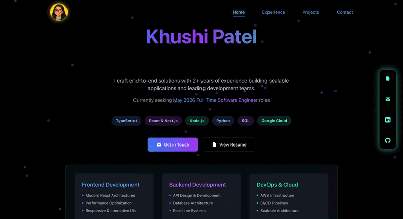

<div align="center">

# ✦ Khushi Patel

### Full Stack Developer · Building things that scale, look good, and actually work.

[](https://khushipatel.vercel.app/)
[](https://www.linkedin.com/in/khushipatel10)
[](https://drive.google.com/file/d/1gepI8ap995pHsSm6xBFkHL4Ow3t0xh15/view?usp=sharing)
[](mailto:kp1032@tamu.edu)

<br/>



</div>

---

## 👩‍💻 About

This is my corner of the internet — a personal portfolio that brings together my work, skills, and story as a full stack developer with **2+ years of experience** crafting scalable, research-driven web applications.

Built with a focus on clean architecture, thoughtful design, and the kind of performance that doesn't make you wait. Currently seeking **May 2026 Full Time Software Engineer** roles. ✨

---

## 🛠️ Tech Stack

| Layer | Technology |
|---|---|
|  Framework | Next.js + React |
|  Language | TypeScript |
|  Styling | Tailwind CSS |
|  Runtime | Node.js |
|  Deployment | Vercel |

---

## ✨ Features

- 🎨 **Interactive UI** — Vanta.js animated background with a sleek dark aesthetic
- 📱 **Fully responsive** — pixel-perfect across every screen size
- 🗂️ **Project showcase** — curated work with context and depth
- ⚡ **Optimized performance** — fast, lightweight, and production-ready
- 🧱 **Clean architecture** — modular, component-based, easy to extend

---

## 🚀 Running Locally

```bash
# Clone the repo
git clone https://github.com/khushipatel-10/Portfolio-Website.git
cd Portfolio-Website

# Install dependencies
npm install

# Fire it up
npm run dev
```

Open [http://localhost:3000](http://localhost:3000) and you're in. 🎉

---

## 📬 Let's Connect

Whether you have a project in mind, a role to fill, or just want to talk tech — my inbox is open.

| | |
|---|---|
| 🌐 Website | [khushipatel.vercel.app](https://khushipatel.vercel.app/) |
| 💼 LinkedIn | [linkedin.com/in/khushipatel10](https://www.linkedin.com/in/khushipatel10) |
| 📄 Resume | [View PDF](https://drive.google.com/file/d/1gepI8ap995pHsSm6xBFkHL4Ow3t0xh15/view?usp=sharing) |
| ✉️ Email | [kp1032@tamu.edu](mailto:kp1032@tamu.edu) |

---

<div align="center">
  <sub>Designed & built by Khushi Patel · © 2025</sub>
</div>